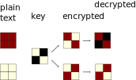
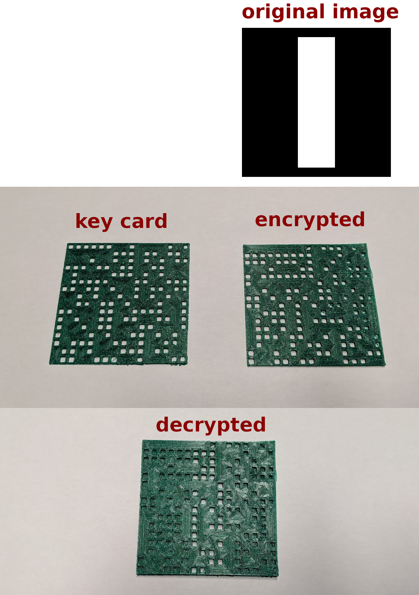

# Encrypt3D: physical imagbe encryption


This program generates 3D printable key/data pairs that encrypt low res binary images.

The encryption is basically a [One-time pad](https://en.wikipedia.org/wiki/One-time_pad), with all its benefits and disatvantages (like being vulnurable to known plaintext attacks).

## operation
Each pixel is represented as a 2x2 grid of sub pixels, for each pixel exactly 2 sub pixels are "set".


First a key is generated by selecting a random arrangement of sub pixels.

If the pixel we are encrypt is "white" we simply copy the 4 sub pixels from the key, if it is "black" we invert them.

By overlaying the key sub pixels and the "encrypted" sub pixels we get either 2 white and 2 black subpixels (i.e. 50% gray) or 4 black subpixels (i.e. black) and thus can reconstruct the image:



## 3D printed example


## usage
### generate a key card stl
```
encrypt_3d --key 42 --grid-width 8 --grid-height 8 --hole-ratio 0.2 generate-key --key-output example/small_key.stl
```


### generate a key card stl
encodes an image, note that you MUST use the same key
```
encrypt_3d --key 42 --grid-width 8 --grid-height 8 --hole-ratio 0.2 encode --image-input example/line.png --image-output example/small_line.stl
```

### optional parameters
number of holes on x axis
```
--grid-width
```

number of holes on y axis
```
--grid-height
```

size of holes (in range 0-1, as ratio to pixel size)
```
--hole-ratio
```

## development setup

- create a virtual env
- install project editable: `pip install -e ".[dev]"`
- install commit hooks: `pre-commit install`

### run all checks
```
pre-commit run --all-files
```
### run specific checks
```
pre-commit run --all-files [HOOK_ID]
```

check `.pre-commit-config.yaml` for `HOOK_ID`

## build
```
python -m build
```
wheels will be in `dist` folder


# acknowledgement
This was not my original idea, I stumbled across something similar done on overhead slides a couple of years ago, but I can't find the original source anymore.

If anyone has relevant references please sub mit a PR or open an issue.
